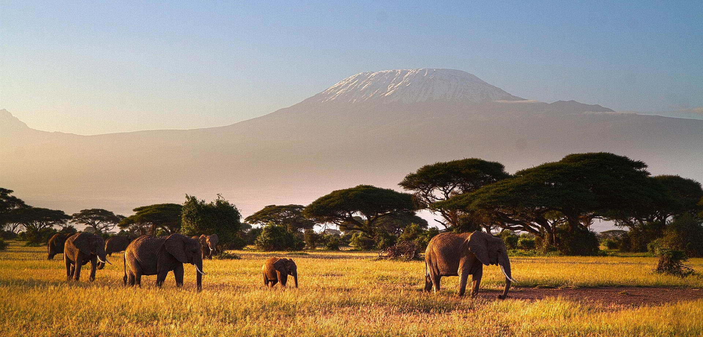

This is an example **standard** page, where content from one single page is displayed. This page also shows how to add classes to Markdown images for floating images left or right, with and without captions.

Lorem ipsum dolor sit amet, consectetur adipiscing elit. Fusce molestie iaculis nisl sed interdum. Praesent mi nisl, efficitur in felis vel, molestie sollicitudin eros. Mauris urna quam, euismod nec lacinia non, dignissim eu odio. Donec nisl nibh, facilisis at nisl vitae, porttitor hendrerit libero. Integer vel neque in ante condimentum malesuada. Mauris dictum nunc enim, non tincidunt arcu tincidunt vel. Aliquam gravida, massa id semper tincidunt, tellus sapien accumsan tortor, in placerat arcu justo ac urna. Vestibulum blandit ultrices neque, eget congue tortor vehicula id.

Lorem ipsum dolor sit amet, consectetur adipiscing elit. Fusce molestie iaculis nisl sed interdum. Praesent mi nisl, efficitur in felis vel, molestie sollicitudin eros. Mauris urna quam, euismod nec lacinia non, dignissim eu odio. Donec nisl nibh, facilisis at nisl vitae, porttitor hendrerit libero. Integer vel neque in ante condimentum malesuada. Mauris dictum nunc enim, non tincidunt arcu tincidunt vel. Aliquam gravida, massa id semper tincidunt, tellus sapien accumsan tortor, in placerat arcu justo ac urna. Vestibulum blandit ultrices neque, eget congue tortor vehicula id.

Aenean maximus placerat mi. Proin a porttitor leo, quis commodo ex. Praesent sit amet neque turpis. Sed fermentum, massa et iaculis vehicula, ligula ipsum tempus diam, ut placerat ligula nisi sed arcu. Nulla dictum sagittis enim sed hendrerit. Nunc eget vestibulum nisl. Integer at ex quis nulla lacinia vulputate a vel neque. Nam elementum id justo vel scelerisque. Fusce finibus erat at purus tincidunt aliquet. Mauris molestie maximus pellentesque. Sed finibus mattis turpis, quis fringilla mi varius vel. Morbi dictum, magna et sollicitudin dignissim, enim libero varius sapien, sit amet sagittis mi quam nec ligula. Proin consectetur nec sapien ac tincidunt. Aliquam faucibus leo a diam ultricies, eu luctus felis consectetur. Ut malesuada turpis id purus viverra, faucibus tempus augue placerat.

Vivamus malesuada lacinia ante vitae tincidunt. Etiam hendrerit cursus tortor quis placerat. Suspendisse tincidunt mi tellus, a eleifend turpis egestas quis. Nunc vulputate enim a maximus iaculis. Cras at nisi nec dolor ullamcorper dapibus. Etiam in leo non tellus pretium ultricies. Duis non quam imperdiet, sodales est in, volutpat risus.

Nunc eget odio luctus, vestibulum ligula non, interdum massa. Ut scelerisque tincidunt justo feugiat sagittis. Vestibulum ante ipsum primis in faucibus orci luctus et ultrices posuere cubilia Curae; Fusce vulputate elementum eros vitae efficitur. Sed volutpat in diam nec ornare. Sed consequat, arcu lacinia vehicula sodales, velit erat condimentum ante, vel vestibulum libero quam ac orci. Sed placerat, nunc vitae euismod convallis, orci justo accumsan odio, non vehicula neque eros id libero. Donec in sagittis risus.
